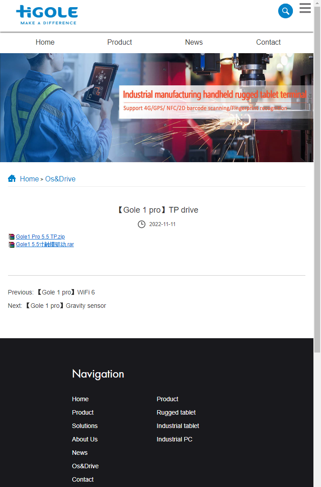

# Windows 10 Build Guide

Upon a successful installation of Windows 10, you will see the following missing drivers in Device Manager:

# Windows Update

Because the wifi driver is not yet installed, we must use wired ethernet via the RJ45 jack to connect to the internet.

Begin by running Windows Update and installing all missing updates until the system is completely up to date.

Start -> Settings -> Update & Security -> Check for Updates

# Wifi Driver

The wifi driver can be downloaded from the HiGole webstie here: https://golerugged.com/supports/335.html

Run setup.exe inside the Wifi folder to install the driver

The missing driver for "Network Controller" should now be satisfied and removed from the list.  You can now switch from wired to wireless.

# Sound Card Driver

The Sound Card Driver can be downloaded from the HiGole website here: https://golerugged.com/supports/333.html

Right click "InstallPackage.bat" and click "Run as Administrator"

The results will not be visible in the missing drivers in Device Manager as sound was already partially working out of the box.

# Optional Windows Updates

Installing optional windows updates will satisfy all but 3 of the remaining missing drivers.

Start -> Settings -> Update & Security - > View optional updates

Device Manager should now look like this:

# Goodix Touch Driver (TouchScreen)

One of the two remaining "Unknown device" requires the Goodix Touch Driver which can be downloaded from the HiGole website here: https://golerugged.com/supports/336.html

This driver must be manually installed.  Double click one of the "Unknon device" in Device Manager and click the "Update Driver" button then click "Browse my computer for drivers" and select the folder where you have extracted the driver.  If this fails, repeat the process with the other "Unknown Device".

# Gravity Sensor (Accelerometer)

The accelerometer driver, which allows the device to auto rotate between portrait and landscape, can be downloaded here: https://golerugged.com/supports/337.html

This driver must be manually installed.  Double click the "Unknon device" in Device Manager and click the "Update Driver" button then click "Browse my computer for drivers" and select the folder where you have extracted the driver.

# On Screen Keyboard

The on screen keyboard can be acessed on the login page by clicking the "Ease of access" button in the bottom right and selecting ""On-Screen Keyboard"

The keyboard can then be used by opening the notifications pane and enabling Tablet mode

# Remote Desktop

To enable Remote Desktop, go to Start -> Settings -> System -> Remote Desktop and set to yes
